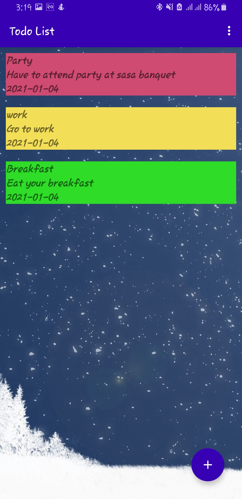
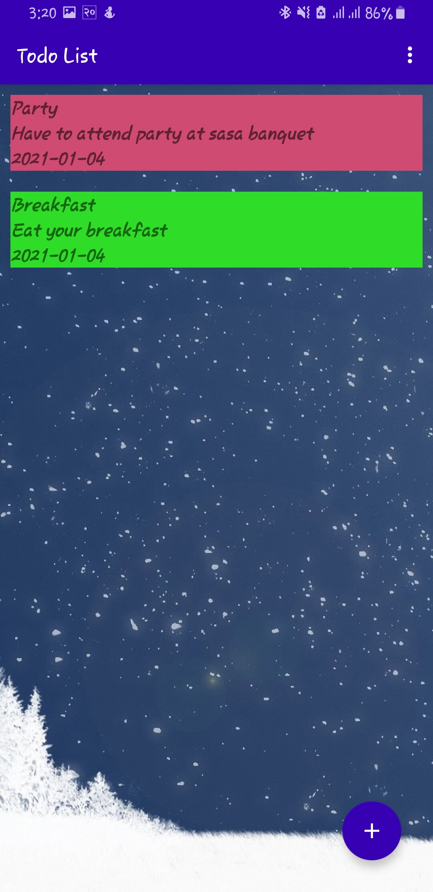

## To-Do List Application

---

### About Installation (Installing and using the App)
#### 1. Register/ Sign Up: Fill the Required Information and Sign Up.
#### 2. Login: After Signing Up Login with the same credentials.
#### 3. Todo List: Click on the floating Add icon and create the Todo List
#### 4. Todo Item: After creating a Todo List ,Now click on the list and create your Todo Items.
#### 5. Editing the Todo Items: Click on the Todo Item and edit it.
#### 6. Deleting the todo items and list: Swipe to delete entry.

### App screenshot

| Splash  | Login | Login_Validation | Login_accepted |
| ------------- | ------------- |------------- | ------------- | 
|  |   |   |  |

| Main_Activity  | Add_Tasks | Task_Validation |
| ------------- | ------------- |------------- |
|  |   |   |

| Saved_Tasks  | Update_Tasks | Updated_task |
| ------------- | ------------- |------------- |
|  |   |   |

| Menu  | Delete_checked | After_Deleting_Checked |
| ------------- | ------------- |------------- |
|  |   |   |

| DeleteAll_Tasks  | Logout |
| ------------- | ------------- |
|  |   |

| Gif |
|------------- | 
|  |

### Resources
1. https://developer.android.com/topic/libraries/architecture/room
2. https://developer.android.com/reference/android/app/Activity